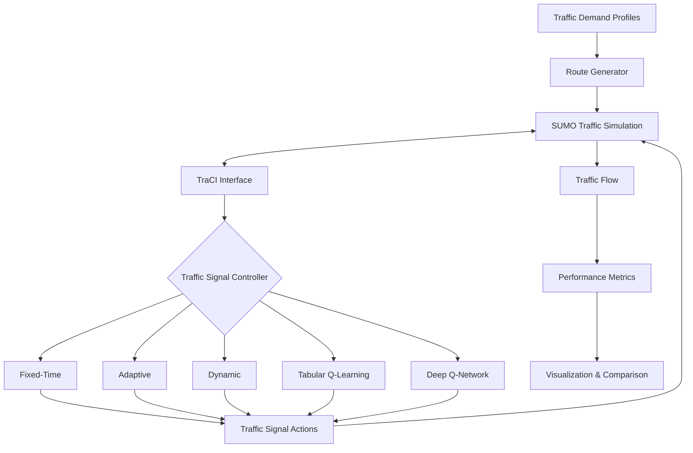
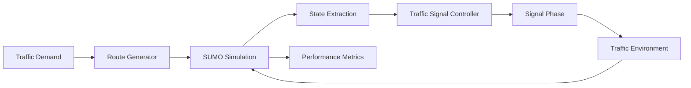

# Traffic Signal Optimization using Reinforcement Learning

A reinforcement learning framework for adaptive traffic signal control built using **SUMO**, **TraCI**, and **PyTorch**. The project compares traditional traffic signal strategies with reinforcement learning approaches, culminating in a Deep Q-Network (DQN) controller that significantly reduces vehicle waiting times under realistic traffic conditions.

## Features

- Four-way signalized intersection with twelve turning movements
- Time-varying traffic demand (night, morning, rush hour, evening)
- Automated traffic route generation
- Multiple traffic signal controllers:
  - Fixed-Time
  - Adaptive
  - Dynamic
  - Tabular Q-learning
  - Deep Q-Network (DQN)
- Reinforcement learning using:
  - Experience Replay
  - Target Networks
  - ε-greedy exploration
- Automated benchmarking and visualization

## Motivation

Traditional traffic signal systems rely on fixed schedules or simple heuristics that often fail to adapt to rapidly changing traffic conditions. Reinforcement learning enables traffic signals to learn control policies directly from traffic observations, improving vehicle flow without requiring manually designed timing plans.

This project explores the progression from conventional traffic control strategies to modern deep reinforcement learning and evaluates their performance under increasingly realistic traffic scenarios.

| Controller | Description |
|------------|-------------|
| Fixed-Time | Uses constant green signal durations regardless of traffic conditions. |
| Adaptive | Switches phases based on current waiting times. |
| Dynamic | Dynamically adjusts green durations according to queue lengths. |
| Tabular Q-learning | Learns an action-value table for traffic signal control. |
| Deep Q-Network | Uses a neural network to approximate Q-values with experience replay and target networks. |

## Architecture

### Overall system architecture

### RL control loop

## Reinforcement Learning

### State

The agent observes:

- North-South queue length
- East-West queue length
- Current traffic signal phase

### Actions

- Keep / switch to North-South green
- Keep / switch to East-West green

### Reward

The reward is defined as the negative cumulative waiting time across all approaches, encouraging the agent to minimize congestion.

## Results

| Controller | Average Wait (s) | Maximum Wait (s) |
|------------|-----------------:|-----------------:|
| Fixed-Time | 195.94 | 536 |
| Adaptive | 71.30 | 169 |
| Dynamic | 217.39 | 791 |
| Q-learning | 37.74 | 183 |
| Deep Q-Network | **32.77** | **75** |

## Future Work

- Evaluate across multiple random traffic seeds
- Integrate real-world traffic datasets
- Support multi-intersection traffic networks
- Investigate Double DQN and PPO
- Extend to larger urban road networks