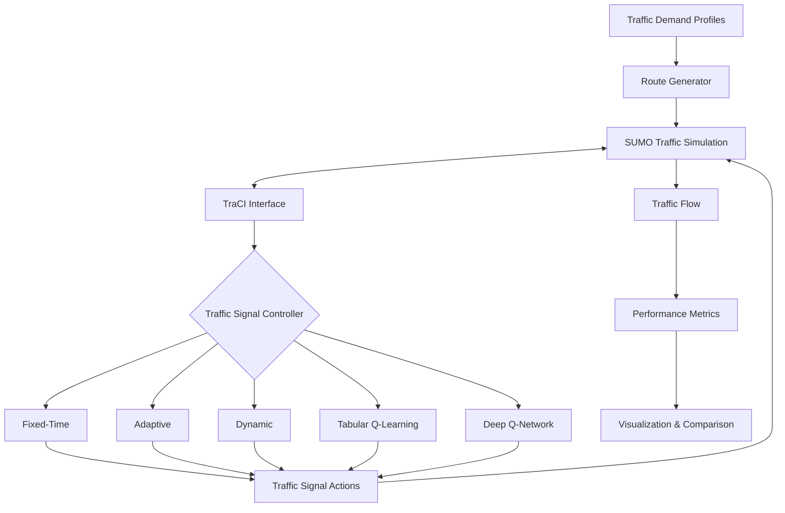
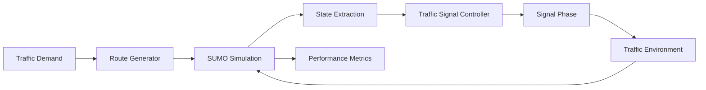
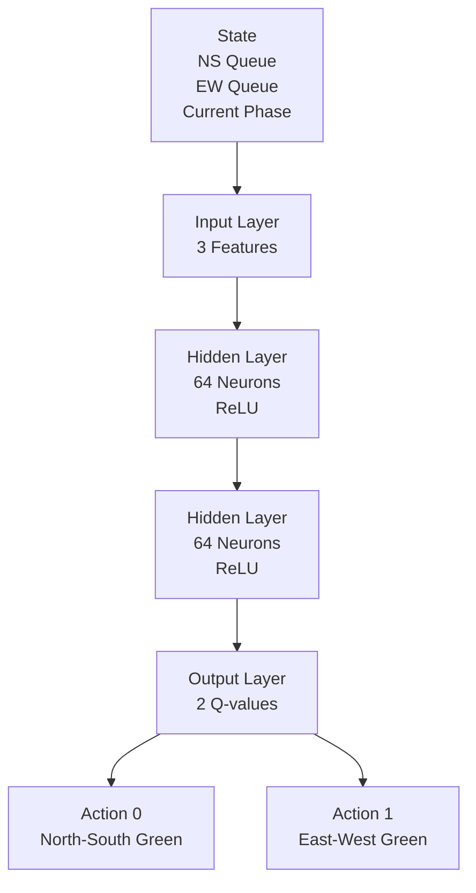
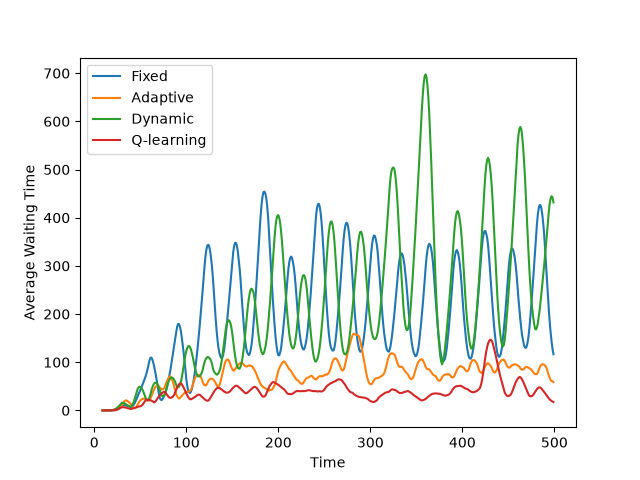

# Traffic Signal Optimization using Reinforcement Learning

A reinforcement learning framework for adaptive traffic signal control built using **SUMO**, **TraCI**, and **PyTorch**. The project compares traditional traffic signal strategies with reinforcement learning approaches, culminating in a Deep Q-Network (DQN) controller that significantly reduces vehicle waiting times under realistic traffic conditions.

The project simulates a single four-way signalized intersection under realistic, time-varying traffic demand and compares traditional traffic engineering methods with reinforcement learning-based control.


## Demo

<p align="center">
  
</p>

The DQN controller learns to dynamically allocate green phases based on real-time traffic conditions, significantly reducing congestion compared to conventional traffic signal strategies.

## Features

- Four-way signalized intersection with twelve turning movements
- Time-varying traffic demand (night, morning, rush hour, evening)
- Automated traffic route generation
- Multiple traffic signal controllers:
  - Fixed-Time
  - Adaptive
  - Dynamic
  - Tabular Q-learning
  - Deep Q-Network (DQN)
- Reinforcement learning using:
  - Experience Replay
  - Target Networks
  - ε-greedy exploration
- Automated benchmarking and visualization

## Motivation

Traditional traffic signal systems rely on fixed schedules or simple heuristics that often fail to adapt to rapidly changing traffic conditions. Reinforcement learning enables traffic signals to learn control policies directly from traffic observations, improving vehicle flow without requiring manually designed timing plans.

This project explores the progression from conventional traffic control strategies to modern deep reinforcement learning and evaluates their performance under increasingly realistic traffic scenarios.

| Controller | Description |
|------------|-------------|
| Fixed-Time | Uses constant green signal durations regardless of traffic conditions. |
| Adaptive | Switches phases based on current waiting times. |
| Dynamic | Dynamically adjusts green durations according to queue lengths. |
| Tabular Q-learning | Learns an action-value table for traffic signal control. |
| Deep Q-Network | Uses a neural network to approximate Q-values with experience replay and target networks. |

## Tech Stack

- Python
- SUMO
- TraCI
- PyTorch
- NumPy
- Pandas
- Matplotlib

## Project Structure

```text
traffic-optimizer/
│
├── simulation/
│   ├── run_fixed.py
│   ├── run_adaptive.py
│   ├── run_dynamic.py
│   ├── run_qlearning.py
│   ├── run_qtest.py
│   ├── run_dqn.py
│   ├── run_dqn_test.py
│   └── metrics.py
│
├── routes/
│   ├── routes_template.rou.xml
│   ├── generate_routes.py
│   └── routes.rou.xml
|
├── network/
│   ├── edges.edg.xml
│   ├── network.net.xml
│   └── nodes.nod.xml
│
├── results/
│   ├── fixed.csv
│   ├── adaptive.csv
│   ├── dynamic.csv
│   ├── qtable.npy
│   ├── qlearning.csv
│   ├── dqn_model.pth
│   ├── best_dqn.pth
│   ├── dqn_training_log.csv
│   ├── dqn.csv
│   ├── plot.py
│   ├── results_table.py
│   ├── comparison_smooth.png
│   └── summary.csv
|
├── assets/
│   └── demo.gif
│
└── README.md
```
## Installation

Clone the repository

```bash
git clone https://github.com/KhushiPandey1805/traffic-optimizer.git
cd traffic-optimizer
```

Or using GitHub CLI

```bash
gh repo clone KhushiPandey1805/traffic-optimizer
cd traffic-optimizer
```

Create a virtual environment

```bash
python -m venv venv
source venv/bin/activate
```

Install dependencies

```bash
pip install -r requirements.txt
```

Install SUMO and ensure `SUMO_HOME` is configured.

## Running the Simulation

Generate traffic routes

```bash
cd routes
python generate_routes.py
```

Train the DQN controller

```bash
cd simulation
python run_dqn.py
```

Evaluate the trained model

```bash
python run_dqn_test.py
```

Compare controller performance

```bash
cd results
python results_table.py
```

## System Architecture

### Overall system architecture


### RL control loop



### Deep Q-Network Architecture



## Reinforcement Learning

### State

The agent observes:

- North-South queue length
- East-West queue length
- Current traffic signal phase

### Actions

- Keep / switch to North-South green
- Keep / switch to East-West green

### Reward

The reward is defined as the negative cumulative waiting time across all approaches, encouraging the agent to minimize congestion.

## Results

### Performance Comparison

| Controller | Average Wait (s) | Maximum Wait (s) |
|------------|-----------------:|-----------------:|
| Fixed-Time | 195.94 | 536 |
| Adaptive | 71.30 | 169 |
| Dynamic | 217.39 | 791 |
| Q-learning | 37.74 | 183 |
| Deep Q-Network | **32.77** | **75** |

The DQN controller reduced average waiting time by ~83% compared to fixed-time control while also achieving the lowest maximum waiting time.

### Waiting Time Comparison

<p align="center">
    
</p>

## Future Work

- Evaluate across multiple random traffic seeds
- Integrate real-world traffic datasets
- Extend to multi-intersection road networks
- Implement Double DQN
- Investigate PPO and other actor–critic methods

## References

- [SUMO Documentation](https://sumo.dlr.de/docs/)
- [TraCI Documentation](https://sumo.dlr.de/docs/TraCI.html)
- [PyTorch](https://pytorch.org/)
- Mnih et al., *Human-Level Control Through Deep Reinforcement Learning*, Nature (2015)

## Acknowledgements

This project uses:

- SUMO (Simulation of Urban MObility)
- TraCI (Traffic Control Interface)
- PyTorch